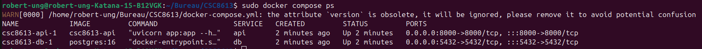
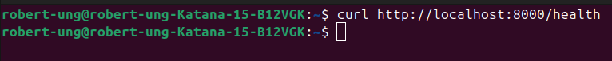
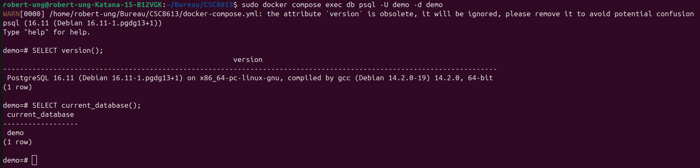

Exercice 1 : Installation de Docker et vérification de l’environnement

Question 1.a  Installez Docker Desktop (Windows / macOS) ou Docker Engine (Linux) en suivant la documentation officielle 

J'ai installé Docker Desktop et Docker Engine sur ma machine Ubuntu.

Question 1.b Vérifiez votre installation en exécutant la commande suivante dans un terminal : docker run hello-world

Le conteneur s’est exécuté correctement. 

Question 1.c  Listez maintenant les conteneurs présents sur votre machine (en cours d'exécution ou arrêtés) : docker ps -a

Cette commande liste tous les conteneurs présents sur la machine. Chaque ligne correspond à un conteneur On y voit l’ID, l’image utilisée, la commande exécutée, l’état (running ou exited), et le nom du conteneur. Dans mon cas, le conteneur hello-world apparaît comme “Exited” car il s’est exécuté puis arrêté automatiquement après avoir affiché son message.

Exercice 2 : Premiers pas avec Docker : images et conteneurs

Question 2.a Expliquez en quelques phrases la différence entre une image Docker et un conteneur Docker.

Une image Docker est un modèle statique qui contient tout ce qui est nécessaire pour exécuter une application : le système de fichiers, les dépendances, la configuration, etc. Elle est immuable.

Un conteneur Docker, au contraire, est une instance en cours d’exécution d’une image. C’est l’image “vivante” : elle possède son propre état, ses processus et son cycle de vie (démarrage, arrêt, suppression).

Question 2.b Exécutez un conteneur très léger basé sur l’image alpine et affichez un message dans la console : docker run alpine echo "Bonjour depuis un conteneur Alpine"

Que se passe-t-il après l'exécution de cette commande ? 

Docker télécharge l’image alpine. Il crée un conteneur basé sur cette image. Le conteneur exécute la commande echo "Bonjour depuis un conteneur Alpine". Le message s’affiche dans la console, puis le conteneur s’arrête immédiatement.

Question 2.c Listez à nouveau les conteneurs présents sur votre machine : docker ps -a

On observe un conteneur basé sur l’image alpine avec son statut Exited. Le conteneur alpine apparaît comme “Exited” car il a terminé son unique tâche (echo) et n’a plus de processus actif. 

Question 2.d Lancez un conteneur interactif basé sur Alpine : docker run -it alpine sh

À l’intérieur du conteneur, tapez les commandes suivantes : 
ls
uname -a
exit

En mode interactif, on peut manipuler le conteneur comme une petite machine Linux. À l’intérieur du conteneur, ls affiche le contenu minimal du système de fichiers Alpine (binaires de base, répertoires système). uname -a affiche les informations du noyau Linux de ma machine hôte car le conteneur partage le noyau de l’OS. exit ferme la session et arrête le conteneur.

Exercice 3 : Construire une première image Docker avec une mini-API FastAPI

Question 3.a  Complétez le code afin que l’API expose une route /health qui renvoie un JSON {"status": "ok"}. 

from fastapi import FastAPI

app = FastAPI()

@app.get("/health")
def health():
    return {"status": "ok"}

Question 3.b Complétez les lignes marquées # TODO. 

FROM python:3.11-slim

WORKDIR /app

COPY app.py /app

RUN pip install fastapi uvicorn

CMD ["uvicorn", "app:app", "--host", "0.0.0.0", "--port", "8000"]

Question 3.c Construisez maintenant l’image Docker à partir du Dockerfile avec la commande suivante : docker build -t simple-api .

La construction s'est bien déroulée !

Exercice 4 : Exécuter l’API FastAPI dans un conteneur Docker

Question 4.a Lancez un conteneur à partir de l’image simple-api en exposant le port 8000 du conteneur sur le port 8000 de votre machine. Utilisez la commande suivante : docker run -p 8000:8000 simple-api

Expliquez dans votre rapport le rôle de l’option -p 8000:8000. 

L’option -p 8000:8000 sert à associer le port 8000 du conteneur au port 8000 de ma machine hôte. Cela signifie que lorsque j’accède à localhost:8000 depuis mon navigateur ou avec curl, la requête est redirigée vers le service qui tourne à l’intérieur du conteneur. Cette option est indispensable pour rendre l’API accessible depuis l’extérieur du conteneur.

Question 4.b Dans un autre terminal (ou via votre navigateur), appelez l’endpoint /health de l’API : curl http://localhost:8000/health

Question 4.c Dans un autre terminal, affichez la liste des conteneurs en cours d’exécution : docker ps

Identifiez la ligne correspondant au conteneur simple-api et notez dans votre rapport :

    le nom du conteneur : ec9eaaf13f25
    l'image utilisée : simple-api
    le port mappé : 8000

Question 4.d Arrêtez le conteneur en cours d’exécution depuis un autre terminal à l’aide de la commande : docker stop <nom_ou_id_du_conteneur>

Puis vérifiez qu’il n’apparaît plus dans docker ps, mais qu’il est toujours visible dans docker ps -a. Expliquez brièvement la différence entre ces deux commandes dans votre rapport. 

La différence entre ces deux commandes est que docker ps affiche uniquement les conteneurs en cours d’exécution, tandis que docker ps -a montre tous les conteneurs, y compris ceux qui sont arrêtés.

Exercice 5 : Démarrer un mini-système multi-conteneurs avec Docker Compose

Question 5.a Organisez votre répertoire de travail de la façon suivante : 
.
├── api/
│   ├── app.py         # votre fichier FastAPI
│   └── Dockerfile     # votre Dockerfile pour l'API
└── docker-compose.yml # à créer à la racine

Question 5.b  Complétez le fichier docker-compose.yml ci-dessous.

version: "3.9"

services:
  db:
    image: postgres:16
    environment:
      POSTGRES_USER: demo
      POSTGRES_PASSWORD: demo
      POSTGRES_DB: demo
    ports:
      - "5432:5432"

  api:
    build: ./api
    ports:
      - "8000:8000"
    depends_on:
      - db

Question 3.c À la racine de votre projet (là où se trouve docker-compose.yml), lancez les services en arrière-plan : docker compose up -d

Puis affichez la liste des services gérés par Docker Compose : docker compose ps

On voit bien que les services db et api sont bien démarrés.

Question 5.d Vérifiez que l’endpoint /health de l’API est toujours accessible, cette fois-ci lorsque l’API est lancée via Docker Compose : curl http://localhost:8000/health

Question 5.e  Lorsque vous avez terminé, arrêtez et supprimez les conteneurs gérés par Docker Compose : docker compose down

Expliquez dans votre rapport la différence entre : Arrêter les services avec docker compose down ; Arrêter un conteneur individuel avec docker stop <id>.

J’ai arrêté proprement les services avec la commande docker compose down. Cette commande supprime tous les conteneurs, réseaux et ressources créés par Docker Compose pour cette stack. La différence avec docker stop <id> est que docker stop arrête uniquement un conteneur individuel, sans supprimer les ressources associées, tandis que docker compose down gère l’ensemble des services définis dans le fichier docker-compose.yml et remet l’environnement dans un état propre.

Exercice 6 : Interagir avec la base de données PostgreSQL dans un conteneur

Question 6.a  Utilisez la commande suivante pour ouvrir un shell psql à l’intérieur du conteneur PostgreSQL : docker compose exec db psql -U demo -d demo
Expliquez dans votre rapport le rôle de chaque option (exec, db, -U, -d). 

L’option exec permet d’exécuter une commande à l’intérieur d’un conteneur déjà en cours d’exécution. Le mot db correspond au nom du service défini dans le fichier docker-compose.yml. L’option -U demo indique l’utilisateur PostgreSQL à utiliser pour la connexion, et -d demo précise le nom de la base de données. Cette commande ouvre un shell interactif psql directement dans le conteneur.

Question 6.b Une fois connecté à psql, exécutez les commandes suivantes : SELECT version(); Puis : SELECT current_database();
Notez dans votre rapport les résultats obtenus, et ajoutez une capture d’écran de la session psql. 

SELECT version() affiche la version de PostgreSQL installée dans le conteneur.SELECT current_database() renvoie le nom de la base de données courante, qui est bien demo. Ces résultats confirment que la base est opérationnelle et que la connexion fonctionne.

PostgreSQL 16.11 (Debian 16.11-1.pgdg13+1) on x86_64-pc-linux-gnu, compiled by gcc (Debian 14.2.0-19) 14.2.0, 64-bit
current_database 
------------------
demo

Question 6.c Dans votre rapport, expliquez comment un autre service Docker (par exemple l’API) pourrait se connecter à la base de données PostgreSQL. 

Un autre service Docker, comme l’API FastAPI, peut se connecter à la base de données PostgreSQL en utilisant directement le nom du service défini dans le fichier docker-compose.yml. Dans ce cas, le hostname à utiliser est db, car Docker Compose crée automatiquement un réseau interne où chaque service est accessible par son nom.

le hostname à utiliser : db
le port : 5432
l’utilisateur et le mot de passe : demo
le nom de la base : demo

Question 6.d  Après vos tests, vous pouvez arrêter la stack : docker compose down

Si l’on ajoute l’option -v, comme dans docker compose down -v, les volumes sont également supprimés, ce qui entraîne la perte définitive des données stockées dans la base. 