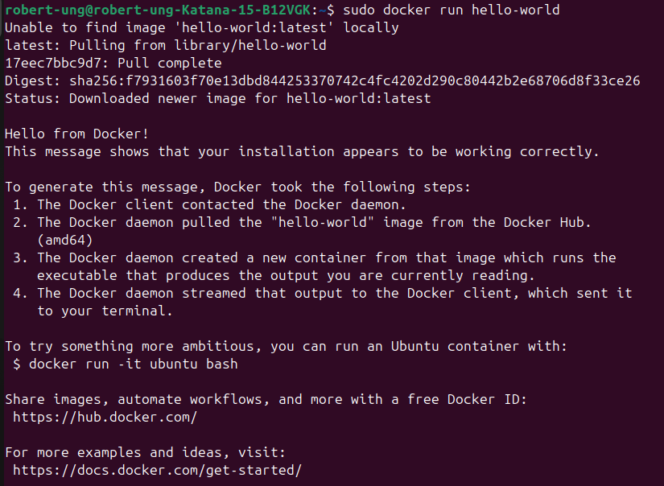
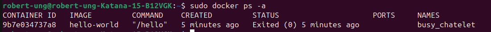
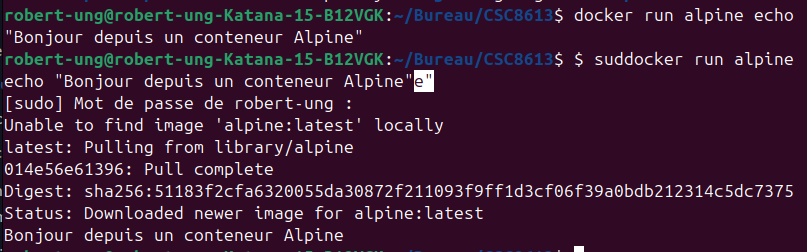
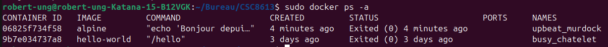
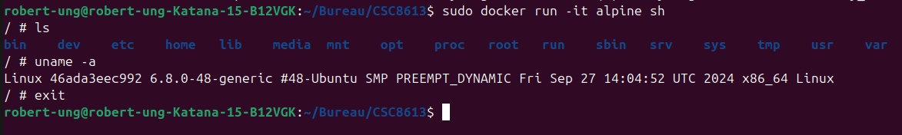
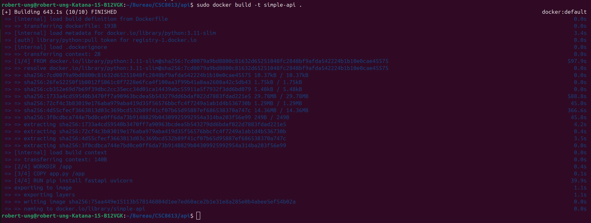
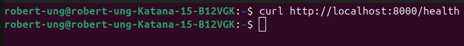

Exercice 1 : Installation de Docker et vérification de l’environnement

Question 1.a  Installez Docker Desktop (Windows / macOS) ou Docker Engine (Linux) en suivant la documentation officielle 

J'ai installé Docker Desktop et Docker Engine sur ma machine Ubuntu.

Question 1.b Vérifiez votre installation en exécutant la commande suivante dans un terminal : docker run hello-world

Le conteneur s’est exécuté correctement. 

Question 1.c  Listez maintenant les conteneurs présents sur votre machine (en cours d'exécution ou arrêtés) : docker ps -a

Cette commande liste tous les conteneurs présents sur la machine. Chaque ligne correspond à un conteneur On y voit l’ID, l’image utilisée, la commande exécutée, l’état (running ou exited), et le nom du conteneur. Dans mon cas, le conteneur hello-world apparaît comme “Exited” car il s’est exécuté puis arrêté automatiquement après avoir affiché son message.

Exercice 2 : Premiers pas avec Docker : images et conteneurs

Question 2.a Expliquez en quelques phrases la différence entre une image Docker et un conteneur Docker.

Une image Docker est un modèle statique qui contient tout ce qui est nécessaire pour exécuter une application : le système de fichiers, les dépendances, la configuration, etc. Elle est immuable.

Un conteneur Docker, au contraire, est une instance en cours d’exécution d’une image. C’est l’image “vivante” : elle possède son propre état, ses processus et son cycle de vie (démarrage, arrêt, suppression).

Question 2.b Exécutez un conteneur très léger basé sur l’image alpine et affichez un message dans la console : docker run alpine echo "Bonjour depuis un conteneur Alpine"

Que se passe-t-il après l'exécution de cette commande ? 

Docker télécharge l’image alpine. Il crée un conteneur basé sur cette image. Le conteneur exécute la commande echo "Bonjour depuis un conteneur Alpine". Le message s’affiche dans la console, puis le conteneur s’arrête immédiatement.

Question 2.c Listez à nouveau les conteneurs présents sur votre machine : docker ps -a

On observe un conteneur basé sur l’image alpine avec son statut Exited. Le conteneur alpine apparaît comme “Exited” car il a terminé son unique tâche (echo) et n’a plus de processus actif. 

Question 2.d Lancez un conteneur interactif basé sur Alpine : docker run -it alpine sh

À l’intérieur du conteneur, tapez les commandes suivantes : 
ls
uname -a
exit

En mode interactif, on peut manipuler le conteneur comme une petite machine Linux. À l’intérieur du conteneur, ls affiche le contenu minimal du système de fichiers Alpine (binaires de base, répertoires système). uname -a affiche les informations du noyau Linux de ma machine hôte car le conteneur partage le noyau de l’OS. exit ferme la session et arrête le conteneur.

Exercice 3 : Construire une première image Docker avec une mini-API FastAPI

Question 3.a  Complétez le code afin que l’API expose une route /health qui renvoie un JSON {"status": "ok"}. 

from fastapi import FastAPI

app = FastAPI()

@app.get("/health")
def health():
    return {"status": "ok"}

Question 3.b Complétez les lignes marquées # TODO. 

FROM python:3.11-slim

WORKDIR /app

COPY app.py /app

RUN pip install fastapi uvicorn

CMD ["uvicorn", "app:app", "--host", "0.0.0.0", "--port", "8000"]

Question 3.c Construisez maintenant l’image Docker à partir du Dockerfile avec la commande suivante : docker build -t simple-api .

La construction s'est bien déroulée !

Exercice 4 : Exécuter l’API FastAPI dans un conteneur Docker

Question 4.a Lancez un conteneur à partir de l’image simple-api en exposant le port 8000 du conteneur sur le port 8000 de votre machine. Utilisez la commande suivante : docker run -p 8000:8000 simple-api

Expliquez dans votre rapport le rôle de l’option -p 8000:8000. 

L’option -p 8000:8000 sert à associer le port 8000 du conteneur au port 8000 de ma machine hôte. Cela signifie que lorsque j’accède à localhost:8000 depuis mon navigateur ou avec curl, la requête est redirigée vers le service qui tourne à l’intérieur du conteneur. Cette option est indispensable pour rendre l’API accessible depuis l’extérieur du conteneur.

Question 4.b Dans un autre terminal (ou via votre navigateur), appelez l’endpoint /health de l’API : curl http://localhost:8000/health

Question 4.c Dans un autre terminal, affichez la liste des conteneurs en cours d’exécution : docker ps

Identifiez la ligne correspondant au conteneur simple-api et notez dans votre rapport :

    le nom du conteneur : ec9eaaf13f25
    l'image utilisée : simple-api
    le port mappé : 8000

Question 4.d Arrêtez le conteneur en cours d’exécution depuis un autre terminal à l’aide de la commande : docker stop <nom_ou_id_du_conteneur>

Puis vérifiez qu’il n’apparaît plus dans docker ps, mais qu’il est toujours visible dans docker ps -a. Expliquez brièvement la différence entre ces deux commandes dans votre rapport. 

La différence entre ces deux commandes est que docker ps affiche uniquement les conteneurs en cours d’exécution, tandis que docker ps -a montre tous les conteneurs, y compris ceux qui sont arrêtés.
