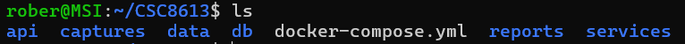
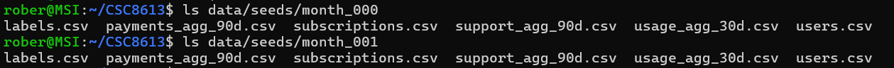
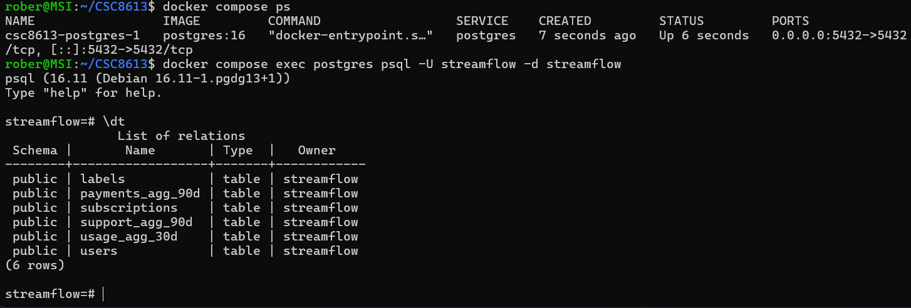
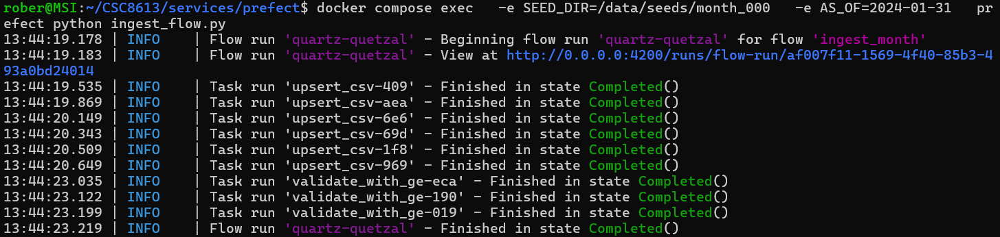

Exercice 1

Question 1.a Reprendre le dépôt du TP1

Etat initial du dépot

rober@MSI:~/CSC8613$ git status
On branch main
Your branch is up to date with 'origin/main'.

nothing to commit, working tree clean

Question 1.b Créer la structure minimale pour le TP2

Question 1.c Télécharger et extraire les données month_000 et month_001

Structure des données

Exercice 2 : Base de données et docker-compose

Question 2.a Créer le schéma de base de données dans db/init/001_schema.sql

Le fichier `db/init/001_schema.sql` a été créé et contient la définition du schéma PostgreSQL de référence pour le projet. Ce schéma définit les tables `users`, `subscriptions`, `usage_agg_30d`, `payments_agg_90d`, `support_agg_90d` et `labels`.  
Il servira de base pour l’ingestion et la validation des données dans les exercices suivants.

Question 2.b Créer et comprendre le fichier .env

Un fichier `.env` a été créé à la racine du projet. Il contient les variables d’environnement nécessaires pour configurer PostgreSQL. Ce fichier permet de séparer la configuration sensible (utilisateur, mot de passe, nom de base) du code et d’injecter automatiquement ces valeurs dans les conteneurs Docker.

Question 2.c Mettre à jour docker-compose.yml

Le fichier `docker-compose.yml` a été mis à jour à la racine du projet.  
Il définit deux services :
- **postgres** : base de données PostgreSQL initialisée avec le schéma `db/init/001_schema.sql` et configurée via `.env`.
- **prefect** : service d’orchestration qui dépend de la base et utilise les mêmes identifiants pour s’y connecter.

Extrait du fichier :

services:
  postgres:
    image: postgres:16
    env_file: .env
    volumes:
      - ./db/init:/docker-entrypoint-initdb.d
      - pgdata:/var/lib/postgresql/data
    ports:
      - "5432:5432"

  prefect:
    build: ./services/prefect
    depends_on:
      - postgres
    env_file: .env
    environment:
      PREFECT_API_URL: http://0.0.0.0:4200/api
      PREFECT_UI_URL: http://0.0.0.0:4200

Question 2.d Démarrer Postgres et vérifier les tables créées

- **users** : contient les informations de base sur les utilisateurs (profil, caractéristiques).
- **subscriptions** : décrit les abonnements et options contractuelles associées à chaque utilisateur.
- **usage_agg_30d** : agrège les données d’utilisation sur 30 jours (heures de visionnage, appareils, etc.).
- **payments_agg_90d** : enregistre les paiements échoués sur une période de 90 jours.
- **support_agg_90d** : stocke les tickets de support et leur temps de résolution sur 90 jours.
- **labels** : contient le label de churn (si l’utilisateur a résilié ou non).

Exercice 3 : Upsert des CSV avec Prefect (month_000)

Question 3.a Créer le service Prefect : services/prefect/Dockerfile et services/prefect/requirements.txt

Un service Prefect a été créé dans `services/prefect/` avec un `Dockerfile` et un fichier `requirements.txt`. Le conteneur Prefect joue un rôle central dans l’architecture : il orchestre le pipeline d’ingestion en définissant et en exécutant les flows (tâches d’ingestion, validation, snapshots). Il permet de coordonner les différentes étapes (lecture des CSV, validation avec Great Expectations, insertion dans PostgreSQL) et d’assurer la reproductibilité et l’automatisation du processus.

Question 3.b Créer le fichier services/prefect/ingest_flow.py (version TP)

La fonction `upsert_csv` permet de charger un fichier CSV dans une table PostgreSQL en appliquant une logique d’upsert :

1. Le CSV est lu avec Pandas et certaines colonnes sont converties en types adaptés (dates, booléens).
2. Les données sont insérées dans une table temporaire créée dynamiquement.
3. Une requête `INSERT ... SELECT ... FROM tmp ON CONFLICT (...) DO UPDATE` copie les données dans la table cible :
   - Si la clé primaire existe déjà, les colonnes non clés sont mises à jour.
   - Sinon, une nouvelle ligne est insérée.
4. La table temporaire est supprimée après l’opération.

Cette logique garantit que les données mensuelles sont intégrées sans doublons et que les informations existantes sont mises à jour.

Question 3.c Lancer Prefect et l’ingestion de month_000

Après exécution du flow Prefect pour le mois 000, nous avons vérifié les tables dans PostgreSQL : 
streamflow=# SELECT COUNT(*) FROM users;
 count
-------
  7043
(1 row)

streamflow=# SELECT COUNT(*) FROM subscriptions;
 count
-------
  7043
(1 row)

Après ingestion du mois 000, nous avons **7043 clients** enregistrés dans la base. Chaque client possède une ligne dans la table `users` et une ligne correspondante dans la table `subscriptions`, ce qui confirme que l’ingestion a correctement inséré les données de ce mois.

Exercice 4 : Validation des données avec Great Expectations

Question 4.a Compléter la fonction validate_with_ge

Décrivez dans votre rapport, en quelques lignes, le rôle de validate_with_ge dans le pipeline. 

La fonction `validate_with_ge` ajoute une étape de contrôle qualité dans le pipeline.  
Elle applique des règles Great Expectations sur les tables ingérées depuis PostgreSQL.  
Si une règle échoue (colonnes manquantes, valeurs négatives, identifiants nuls), le flow Prefect est interrompu. Cela garantit que seules des données conformes et cohérentes sont utilisées dans les étapes suivantes (snapshots, entraînement ML).

Question 4.b Relancer l’ingestion pour month_000 avec validation

Le flow Prefect a été relancé avec Great Expectations.  
Les validations sur `users`, `subscriptions` et `usage_agg_30d` se sont exécutées.
Cette étape garantit que seules des données conformes sont intégrées dans la base avant les snapshots et l’entraînement ML.

Question 4.c Compléter le rapport : pourquoi ces bornes et comment protègent-elles le modèle ?

## Validation des données

Dans la table `usage_agg_30d`, nous avons ajouté plusieurs expectations avec Great Expectations afin de garantir la cohérence des agrégats. Par exemple, nous avons écrit :  

copiez quelques lignes de vos expectations pour usage_agg_30d (par exemple les appels à expect_column_values_to_be_between) ;

gdf.expect_column_values_to_be_between("watch_hours_30d", min_value=0)
gdf.expect_column_values_to_be_between("avg_session_mins_7d", min_value=0)
gdf.expect_column_values_to_be_between("unique_devices_30d", min_value=0)
gdf.expect_column_values_to_be_between("skips_7d", min_value=0)
gdf.expect_column_values_to_be_between("rebuffer_events_7d", min_value=0)

expliquez, en quelques phrases, pourquoi vous avez choisi ces bornes, par exemple watch_hours_30d >= 0 ;

Nous avons choisi ces bornes car il n’est pas possible d’avoir des valeurs négatives pour des mesures de temps ou des comptages. Les heures de visionnage et la durée moyenne des sessions doivent être supérieures ou égales à zéro, tout comme le nombre d’appareils, de skips ou d’événements de rebuffering. Une valeur négative indiquerait soit une erreur d’export, soit une corruption des données.

expliquez comment ces règles protègent votre futur modèle (exclusion de valeurs impossibles, détection d’exports corrompus, etc.).

Ces règles protègent notre futur modèle en empêchant l’utilisation de données impossibles ou incohérentes. Elles permettent de détecter rapidement des anomalies dans les fichiers CSV avant qu’elles ne soient intégrées dans la base et propagées dans les étapes suivantes du pipeline. En garantissant que seules des données valides sont utilisées, nous renforçons la robustesse du modèle et évitons qu’il apprenne sur des informations erronées qui pourraient fausser ses prédictions.

Exercice 5 : Snapshots et ingestion month_001

Question 5.a Compléter la fonction snapshot_month(as_of)

Ajoutez dans votre rapport une phrase expliquant ce que fait snapshot_month (en particulier le rôle de as_of). 

La fonction `snapshot_month(as_of)` fige l’état des données à la fin d’un mois donné en copiant les tables live vers des tables de snapshots. Le paramètre `as_of` sert à dater ces enregistrements : il garantit que chaque utilisateur possède une version de ses données associée à une date précise, ce qui permet de reconstruire l’historique et d’entraîner le modèle uniquement sur des états cohérents et temporellement alignés.

Question 5.b Ingestion de month_001 avec snapshots

Copiez ces résultats dans votre rapport et commentez brièvement : avez-vous le même nombre de lignes ? davantage ? Pourquoi ? 

Après ingestion des mois 000 et 001, nous avons vérifié la table `subscriptions_profile_snapshots` :

streamflow=# SELECT COUNT(*) FROM subscriptions_profile_snapshots WHERE as_of = '2024-01-31';
 count
-------
  7043
(1 row)

streamflow=# SELECT COUNT(*) FROM subscriptions_profile_snapshots WHERE as_of = '2024-02-29';
 count
-------
  7043
(1 row)

Les snapshots de janvier et février contiennent le même nombre de lignes (7043). Cela montre que le nombre de clients est resté stable entre ces deux dates, sans nouveaux abonnés ni pertes. Les snapshots permettent de figer l’état de la base à chaque fin de mois et de constater facilement l’évolution (ou la stabilité) du nombre de clients.

Question 5.c Compléter le rapport : schéma, explications et réflexion

Voici une représentation simplifiée du pipeline mis en place :

                +------------------+
                |   CSV mensuels   |
                +------------------+
                         |
                         v
                +------------------+
                |   Prefect Flow   |
                |  (ingest_month)  |
                +------------------+
                         |
                         v
                +------------------+          
                |   Upsert tables  |          
                |   (PostgreSQL)   |          
                +------------------+          
                         |
                         v
                +------------------+
                | Validation GE    |
                | (qualité données)|
                +------------------+
                         |
                         v
                +------------------+
                |  Snapshots mens. |
                | (tables *_snap)  |
                +------------------+
                         |
                         v
                +------------------+
                |  Modèle ML       |
                | (entraînement)   |
                +------------------+

Pourquoi on ne travaille pas directement sur les tables live pour entraîner un modèle ?

Nous ne travaillons pas directement sur les tables live pour entraîner un modèle, car celles-ci évoluent en continu et ne garantissent pas une cohérence temporelle. Utiliser les données live risquerait d’introduire du **data leakage**, c’est-à-dire que le modèle pourrait apprendre à partir d’informations qui n’étaient pas disponibles à la date d’entraînement, faussant ainsi ses performances.

Pourquoi les snapshots sont importants pour éviter la data leakage et garantir la reproductibilité temporelle ?

Les snapshots sont essentiels car ils figent l’état des données à une date donnée (`as_of`). Ils permettent de reconstruire l’historique mois par mois, d’assurer la reproductibilité des expériences et de garantir que le modèle est entraîné uniquement sur des données disponibles à ce moment-là. Cela évite les biais temporels et assure une validation correcte des performances.

Qu’avez-vous trouvé le plus difficile dans la mise en place de l’ingestion ?

La partie la plus difficile dans la mise en place de l’ingestion a été de gérer correctement les interactions entre Docker, PostgreSQL et Prefect, notamment la configuration des variables d’environnement et la logique d’upsert. 

