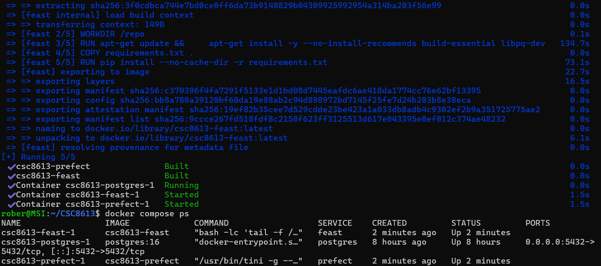
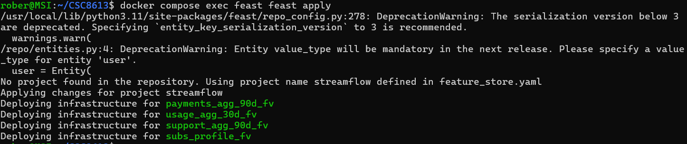
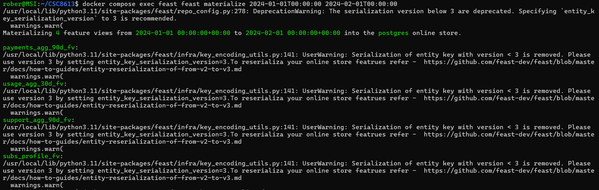
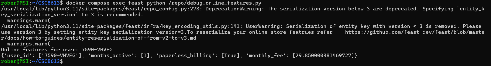
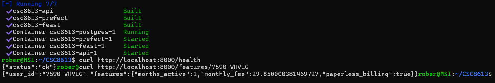
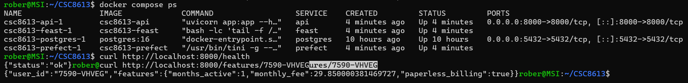

Exercice 1 : Setup initial, création du rapport et balisage Git

# Contexte

Question 1.c Dans la section # Contexte de votre rapport, écrivez un court paragraphe expliquant ou décrivant les points suivants :

- Les données dont vous disposez déjà (snapshots mensuels pour deux périodes, tables utilisateurs, usage, abonnements, paiements, support…).

- L’objectif du TP3 : brancher ces données au Feature Store Feast, récupérer des features en mode offline et online, et exposer un endpoint API simple utilisant ces features.

Après avoir mis en place l’ingestion et les snapshots mensuels dans le TP2, nous disposons désormais de données fiables et figées pour plusieurs périodes (utilisateurs, abonnements, usage, paiements, support). Le TP3 a pour objectif de brancher ces données au Feature Store Feast, afin de préparer l’entraînement d’un modèle de churn et de commencer à exposer les features en production. Cette étape marque la transition entre la préparation des données et leur exploitation opérationnelle, en permettant à StreamFlow de gérer les features de manière centralisée, reproductible et utilisable à la fois en mode offline pour l’entraînement et en mode online pour la prédiction.

Exercice 2 : Ajout de Feast à l’architecture Docker

Question 2.a Nous allons d’abord préparer le service Feast côté code, puis l’ajouter à la composition Docker. 

Question 2.b  Modifiez maintenant votre docker-compose.yml pour ajouter un service feast. Dans le bloc services:, ajoutez un service en complétant les champs marqués # TODO.

build: ./services/feast_repo → indique que l’image du service Feast doit être construite à partir du Dockerfile situé dans services/feast_repo.

volumes: - ./services/feast_repo/repo:/repo → monte le dossier local ./services/feast_repo/repo dans /repo à l’intérieur du conteneur, ce qui permet d’exécuter les commandes Feast directement sur la configuration (feature_store.yaml, entities.py, etc.).

Question 2.c Construisez les images et démarrez les services en arrière-plan : docker compose up -d --build

Question 2.d Dans la section # Mise en place de Feast de votre reports/rapport_tp3.md :

# Mise en place de Feast

Collez la commande exacte que vous avez utilisée pour démarrer les services.

Pour démarrer les services avec le nouveau conteneur Feast, nous avons utilisé la commande :
docker compose up -d --build

Écrivez 2–3 lignes expliquant le rôle du conteneur feast :
    où se trouve la configuration du Feature Store dans le conteneur ;
    comment vous allez l’utiliser (via docker compose exec feast ... pour lancer feast apply et feast materialize).

Le conteneur `feast` contient la configuration du Feature Store dans le répertoire `/repo`, où se trouvent les fichiers `feature_store.yaml`, `entities.py`, `data_sources.py` et `feature_views.py`. Nous allons l’utiliser en lançant des commandes telles que `docker compose exec feast feast apply` pour appliquer la configuration et créer le registre, puis `docker compose exec feast feast materialize` pour matérialiser les features dans l’Online Store.

Exercice 3 : Définition de l’Entity, des DataSources et des FeatureViews (Feast)

Question 3.a Dans votre rapport (# Définition du Feature Store), ajoutez un court paragraphe expliquant : ce qu’est une Entity dans Feast ; pourquoi user_id est un bon choix de clé de jointure pour StreamFlow.

## Définition du Feature Store

Dans Feast, une Entity est l’objet qui permet d’identifier les entités métier pour lesquelles les features sont définies. Elle sert de clé de référence pour relier les différentes sources de données et regrouper les features autour d’un même identifiant. Dans le cas de StreamFlow, l’entité centrale est l’utilisateur, identifié par `user_id`. Ce choix est pertinent car toutes les tables (abonnements, usage, paiements, support, labels) utilisent `user_id` comme clé primaire ou clé de jointure. Cela garantit que les features peuvent être correctement alignées et récupérées pour chaque client, aussi bien en mode offline pour l’entraînement qu’en mode online pour la prédiction.

Question 3.b Dans votre rapport, section # Définition du Feature Store, indiquez :

le nom d’une table de snapshot (par ex. usage_agg_30d_snapshots) ;
3–4 colonnes de features qu’elle contient.

Nous avons défini plusieurs DataSources PostgreSQL correspondant aux tables de snapshots créées dans le TP2. Par exemple, la table `usage_agg_30d_snapshots` contient les colonnes suivantes :

- `user_id` : identifiant de l’utilisateur (clé de jointure avec l’entité user)  
- `as_of` : date du snapshot (référence temporelle)  
- `watch_hours_30d` : nombre d’heures de visionnage sur 30 jours  
- `avg_session_mins_7d` : durée moyenne des sessions sur 7 jours  
- `unique_devices_30d` : nombre d’appareils uniques sur 30 jours  
- `skips_7d` et `rebuffer_events_7d` : indicateurs d’usage et de qualité de service

Ces colonnes représentent des features pertinentes pour le modèle de churn, car elles décrivent l’activité et l’expérience utilisateur sur la plateforme.

Question 3.c 

Une fois les FeatureViews définies, nous avons exécuté la commande : docker compose exec feast feast apply

La commande se termine sans erreur et le fichier registry.db est apparu dans services/feast_repo/repo/.

Dans votre rapport (# Définition du Feature Store), expliquez en 2–3 phrases à quoi sert feast apply.

Cette commande lit la configuration du Feature Store (entities, sources, FeatureViews) et met à jour le registre (`registry.db`). Elle sert à synchroniser la définition du Feature Store avec l’état réel du système, en créant ou modifiant les FeatureViews dans le registre. Cela garantit que les features sont correctement déclarées et disponibles pour les requêtes offline et online.

Exercice 4 : Utilisation offline et online des features (Feast + API)

Question 4.b Créez un nouveau script Python services/prefect/build_training_dataset.py.

# Récupération offline & online

Nous avons créé un script `build_training_dataset.py` qui construit un `entity_df` à partir des snapshots du 31 janvier 2024, puis utilise Feast pour récupérer les features définies dans les FeatureViews. Ces features sont jointes avec les labels de churn sur `(user_id, event_timestamp)` afin de produire un dataset d’entraînement cohérent. Le résultat est sauvegardé dans `/data/processed/training_df.csv`, prêt à être utilisé pour l’entraînement du modèle de churn.

Question 4.c Exécutez ce script dans le conteneur prefect : docker compose exec prefect python build_training_dataset.py

Nous avons exécuté le script de construction du dataset d’entraînement dans le conteneur Prefect avec la commande : docker compose exec prefect python build_training_dataset.py

Le script a généré le fichier `data/processed/training_df.csv` sur la machine hôte. Nous avons vérifié son contenu avec : head -5 data/processed/training_df.csv

Question 4.d Toujours dans votre rapport, expliquez en 2–3 phrases comment Feast garantit la temporal correctness (point-in-time correctness) lors de cette récupération offline. Appuyez-vous sur :

    le champ timestamp_field = "as_of" dans vos DataSources ;
    la structure de entity_df (user_id + event_timestamp).

Feast garantit la temporal correctness (point‑in‑time correctness) lors de la récupération offline grâce à deux mécanismes complémentaires. D’une part, chaque DataSource définit `timestamp_field = "as_of"`, ce qui permet à Feast de ne sélectionner que les features valides à la date du snapshot. D’autre part, l’`entity_df` contient pour chaque utilisateur (`user_id`) un `event_timestamp` qui sert de référence temporelle. Lors de la jointure, Feast s’assure que seules les valeurs de features disponibles avant ou au moment de cet `event_timestamp` sont utilisées, évitant ainsi toute fuite d’information depuis le futur.

Question 4.e Matérialisation & récupération online

Nous avons matérialisé les features dans l’Online Store avec la commande : docker compose exec feast feast materialize 2024-01-01T00:00:00 2024-02-01T00:00:00

Question 4.f Toujours dans le conteneur feast, lancez un shell Python interactif ou créez un petit script, par exemple services/feast_repo/repo/debug_online_features.py, pour tester get_online_features.

Nous avons testé la récupération online avec un script `debug_online_features.py` exécuté dans le conteneur Feast : docker compose exec feast python /repo/debug_online_features.py

La sortie montre les features disponibles pour l’utilisateur choisi (par ex. `user_id = 7590-VHVEG`), confirmant que la matérialisation a bien rempli l’Online Store et que les données sont accessibles en temps réel.

Question 4.g Dans votre rapport (# Récupération offline & online) :

copiez le dictionnaire retourné par get_online_features pour un utilisateur (sortie du script) ;
ajoutez une phrase pour expliquer ce qui se passe si vous interrogez un user_id qui n’a pas de features matérialisées (par exemple : utilisateur inexistant ou en dehors de la fenêtre de matérialisation).

Nous avons testé la récupération online avec le script `debug_online_features.py`.  
La sortie pour l’utilisateur choisi (`user_id = 7590-VHVEG`) est la suivante :
{'user_id': ['7590-VHVEG'], 'months_active': [1], 'paperless_billing': [True], 'monthly_fee': [29.850000381469727]}

Si nous interrogeons un `user_id` qui n’a pas de features matérialisées (par exemple un utilisateur inexistant ou en dehors de la fenêtre de matérialisation), Feast retourne `None` pour les features demandées. Cela garantit que seules les données valides et disponibles dans l’Online Store sont renvoyées.

Question 4.h J'ai mis à jour les fichiers docker-compose.yml, api/Dockerfile et api/requirements.txt. J'ai ensuite lancé la commande : docker compose up -d --build

Question 4.i  Modifiez maintenant le fichier api/app.py (vous aviez un endpoint /health dans les TP précédents). 

Question 4.j Vérifiez que l’API fonctionne : 

Nous avons vérifié que le service `api` est bien démarré : docker compose ps
Puis nous avons testé l’endpoint `/health` : curl http://localhost:8000/health
Enfin, nous avons interrogé l’endpoint `/features/{user_id}` pour un utilisateur existant (par ex. `7590-VHVEG`) : curl http://localhost:8000/features/7590-VHVEG

Cette réponse confirme que l’API est correctement connectée au Feature Store et qu’elle renvoie bien les features matérialisées pour un utilisateur donné.

Question 4.k Dans la section # Réflexion de votre rapport, répondez brièvement (3–5 lignes) à la question suivante : « En quoi ce endpoint /features/{user_id}, basé sur Feast, nous aide-t-il à réduire le training-serving skew dans un système de ML en production ? » 

# Réflexion

Le endpoint `/features/{user_id}`, basé sur Feast, permet de réduire le training‑serving skew car il garantit que les mêmes définitions de features sont utilisées à la fois pour l’entraînement (offline) et pour la prédiction (online). Les données sont matérialisées avec un champ temporel (`as_of`) et récupérées via `get_online_features`, ce qui assure la cohérence entre les snapshots historiques et les requêtes en temps réel. Ainsi, le modèle consomme exactement les mêmes transformations de données en production que celles utilisées lors de son apprentissage, évitant les divergences entre phases.

Question 4.l Le dépôt a été tagué avec tp3
