Exercice 1 : Mise en route + rappel de contexte

Question 1.a. Démarrez la stack Docker Compose et vérifiez que les conteneurs principaux démarrent sans erreur.

Nous avons démarré la stack Docker Compose avec : docker compose up -d --build. Puis nous avons vérifié que les conteneurs principaux étaient bien en cours d’exécution : docker compose ps

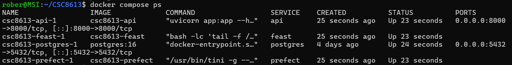

Question 1.b. Ajoutez le service MLfow dans docker-compose.yml, puis redémarrez la stack.

le service `mlflow` démarre correctement.

Question 1.c. Vérifiez l’accessibilité des interfaces et endpoints suivants : MLflow UI (localhost:5000), API /health (localhost:8000).

Nous avons vérifié l’accessibilité des interfaces :

- MLflow UI est accessible sur `http://localhost:5000` et affiche l’interface de suivi et de registry.
- L’API FastAPI répond correctement sur `http://localhost:8000/health`

Question 1.d. Faites un smoke check : vérifiez que la récupération de features online fonctionne toujours via l’endpoint existant /features/{user_id}.

Nous avons vérifié que la récupération de features online fonctionne toujours via l’endpoint `/features/{user_id}` : curl http://localhost:8000/features/7590-VHVEG

Réponse Json : {"user_id":"7590-VHVEG","features":{"months_active":1,"monthly_fee":29.850000381469727,"paperless_billing":true}}

Ce test confirme que l’API est bien connectée au Feature Store et que les features matérialisées sont accessibles en ligne.

Question 1.e. Dans votre rapport reports/rapport_tp4.md, listez :
1. les commandes utilisées,
2. une preuve que chaque service est accessible (captures ou sortie terminal),
3. un court paragraphe : “quels composants tournent et pourquoi”.

## Commandes utilisées

Démarrage et reconstruction de la stack : docker compose up -d --build

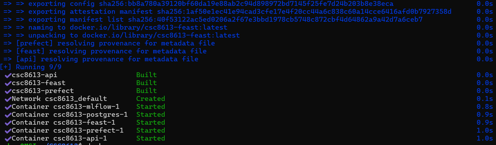

Vérification des conteneurs : docker compose ps

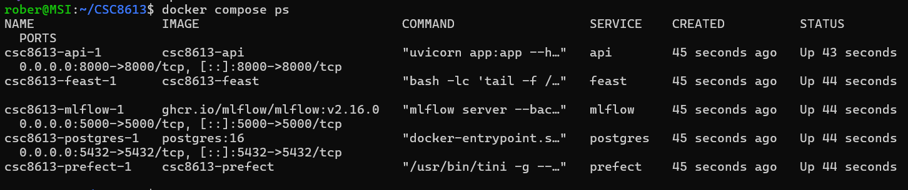

Test de l’API FastAPI : 
curl http://localhost:8000/health 
curl http://localhost:8000/features/7590-VHVEG

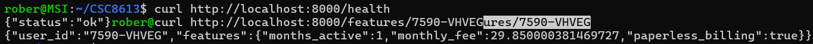

Test de l’interface MLflow : http://localhost:5000

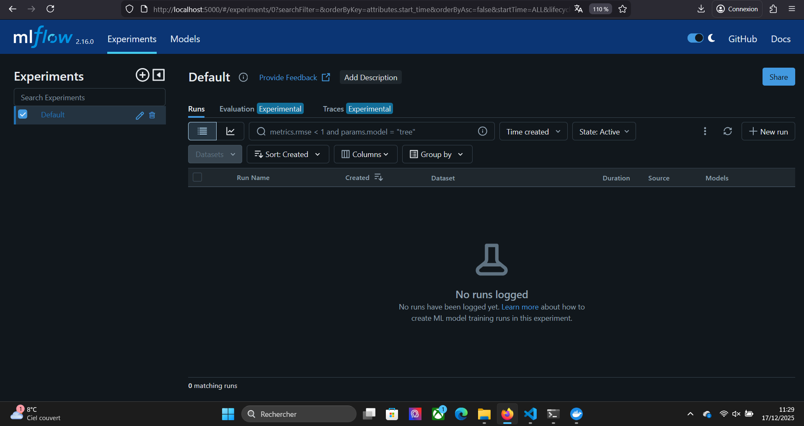

## Quels composants tournent et pourquoi

- **Postgres** : sert de base de données pour stocker les snapshots et l’Online Store.  
- **Feast** : gère le Feature Store, la matérialisation et la récupération des features.  
- **Prefect** : orchestre les pipelines et tâches de données.  
- **API (FastAPI)** : expose les endpoints `/health` et `/features/{user_id}` pour servir les features aux applications.  
- **MLflow** : fournit le tracking des expériences et le Model Registry pour gérer les versions de modèles.  

Ces composants tournent ensemble pour constituer une stack MLOps minimale : ingestion et matérialisation des features, exposition via API, et traçabilité des modèles via MLflow.

Exercice 2 : Créer un script d’entraînement + tracking MLflow (baseline RandomForest)

Question 2.a Créez le fichier services/prefect/train_baseline.py et copiez le squelette ci-dessous. Complétez ensuite les zones marquées par _______ (ce sont vos TODO).

TODO 9

On enregistre pipe et non seulement clf, car la pipeline inclut le préprocessing (OneHotEncoder pour les colonnes catégorielles, passthrough pour les numériques). Si on ne loggait que le clf, le modèle ne saurait pas gérer les features brutes en production : il manquerait l’étape de transformation. En loggant la pipeline complète, on garantit que le modèle est utilisable tel quel en serving.

Question 2.b Exécutez votre script train_baseline.py dans le conteneur prefect sur month_000 avec docker compose exec -e TRAIN_AS_OF=_________ prefect \ python /opt/prefect/flows/train_baseline.py

Vérifiez qu’il se termine avec un message [OK] et un run_id. 

La commande se termine avec un message [OK] et un run_id. 

Question 2.c  Dans votre rapport reports/rapport_tp4.md, indiquez :

la valeur de AS_OF utilisée,
le nombre de lignes de votre dataset d’entraînement (après merge),
les colonnes catégorielles détectées (cat_cols),
les trois métriques calculées (AUC, F1, ACC) et le temps d’entraînement.

- **Valeur de AS_OF utilisée** : `2024-01-31`

- **Nombre de lignes du dataset d’entraînement (après merge)** : 7043

- **Colonnes catégorielles détectées (`cat_cols`)** :  
  - `net_service`

- **Métriques calculées sur le jeu de validation** :  
  - AUC : 0.827
  - F1 : 0.513
  - Accuracy : 0.791

- **Temps d’entraînement** : 0.469 secondes

Question 2.d. Toujours dans le rapport, expliquez en 5–8 lignes pourquoi on fixe :
• AS_OF et
• random_state,
dans un pipeline MLOps orienté reproductibilité.

Dans un pipeline MLOps, la reproductibilité est essentielle pour comparer les modèles et valider les résultats.  
- AS_OF est fixé afin de garantir que l’on entraîne toujours sur le même snapshot temporel des données. Cela évite que des variations liées à l’évolution du dataset (nouvelles lignes, mises à jour) ne faussent les comparaisons entre runs. On peut ainsi rejouer l’entraînement et obtenir exactement le même jeu d’exemples.  
- random_state est fixé pour contrôler l’aléa dans les étapes de split des données et dans l’initialisation du modèle. Sans cette graine, chaque exécution produirait des résultats légèrement différents, rendant impossible la comparaison fiable des métriques.  
En fixant ces deux paramètres, on assure que les runs MLflow sont traçables, reproductibles et comparables, ce qui est une condition clé pour un pipeline MLOps robuste.

Exercice 3

Question 3.a. Ouvrez l’interface graphique de MLflow et identifiez l’expérience associée à votre entraînement (MLFLOW_EXPERIMENT, par défaut streamflow).

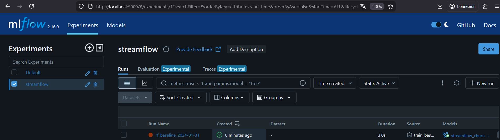

Question 3.b. Sélectionnez le run correspondant à votre exécution de train_baseline.py et explorez : les paramètres, les métriques et les artefacts associés.

Question 3.c. Accédez au Model Registry dans l’UI MLflow et localisez le modèle streamflow_churn qui a été enregistré par votre script.

Question 3.d. Depuis l’interface MLflow, promouvez la dernière version du modèle streamflow_churn vers le stage Production. Par simplicité, utiliser l'ancien interface ("New model registry UI" sur off sur la page de la version) et modifier le Stage.

Question 3.e. Vérifiez dans le Model Registry qu’une (et une seule) version du modèle est désormais en Production, et notez son numéro de version.

Dans le Model Registry de MLflow, nous avons vérifié que le modèle `streamflow_churn` possède une seule version promue en Production.

- **Nom du modèle** : `streamflow_churn`
- **Version en Production** : `10`

Cela confirme que la version 10 est actuellement la référence pour les prédictions en environnement de production.

Question 3.f. Dans votre rapport reports/rapport_tp4.md, incluez :
• une capture de l’UI MLflow montrant le run (métriques + artefacts),
• une capture du Model Registry avec le modèle en Production,
• le numéro de version promu.

**Capture du run MLflow** : 

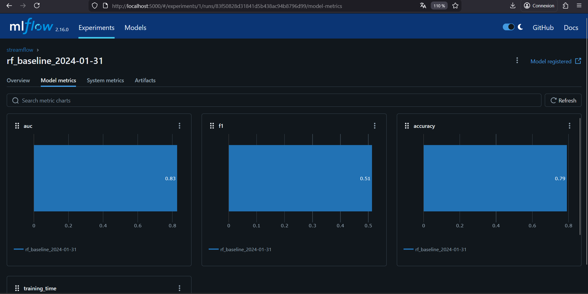
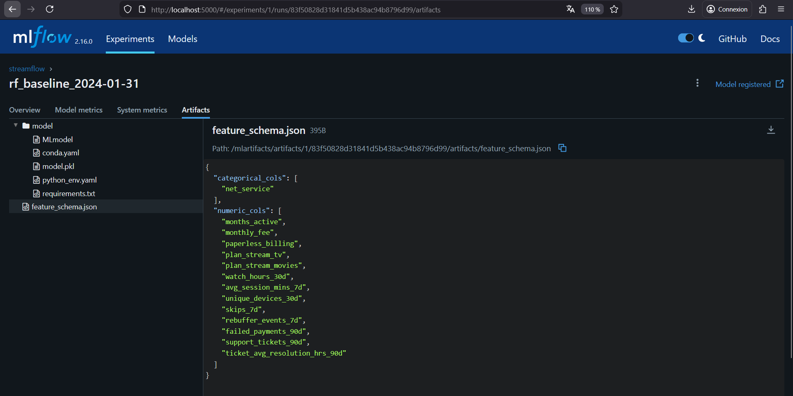

**Capture du Model Registry**

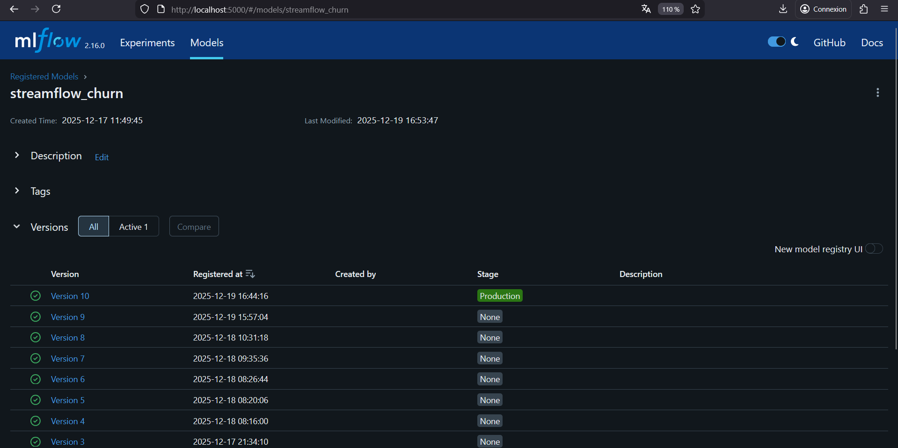

**Numéro de version promue** : `10`

Question 3.g. Expliquez en 5–8 lignes pourquoi la promotion via une interface (stages None, Staging, Production) est préférable à un déploiement manuel basé sur des fichiers ou des chemins locaux.

La promotion d’un modèle via l’interface MLflow et ses stages (`None`, `Staging`, `Production`, `Archived`) est préférable à un déploiement manuel basé sur des fichiers ou des chemins locaux pour plusieurs raisons. Elle assure une traçabilité complète : chaque version est enregistrée avec ses métriques, paramètres et source de données. Elle garantit la reproductibilité : on peut rejouer un run et retrouver exactement le modèle promu. Elle facilite la collaboration : plusieurs équipes peuvent voir quel modèle est en test (Staging) et lequel est validé (Production).  
Elle réduit les risques d’erreur liés à la manipulation manuelle de fichiers ou de chemins locaux. Enfin, elle permet un cycle de vie structuré du modèle, avec des transitions claires entre expérimentation, validation et mise en production.

Exercice 4

Question 4.a. Modifiez les requirements.txt de l'API

Question 4.b. Ajoutez MLFLOW_TRACKING_URI=http://mlflow:5000 dans .env.

Question 4.c Modifiez api/app.py pour ajouter un endpoint POST /predict. Vous devez aussi charger le Feature Store et le modèle MLflow “Production”.

Question 4.d Redémarrez uniquement le service api (pas toute la stack) en regénérant l'image à partir du Dockerfile de l'API si nécessaire, puis vérifiez que l’API est accessible.

**Commandes exécutées** :

docker compose build api
docker compose up -d api
docker compose ps api

Question 4.e. Testez POST /predict avec un user_id valide via Swagger UI ou via curl.

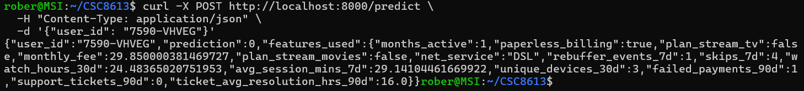

Question 4.f  Dans votre rapport reports/rapport_tp4.md, incluez :

    une requête réussie (capture Swagger ou commande curl),
    la réponse JSON obtenue.

Capture Swagger depuis http://localhost:8000/docs :
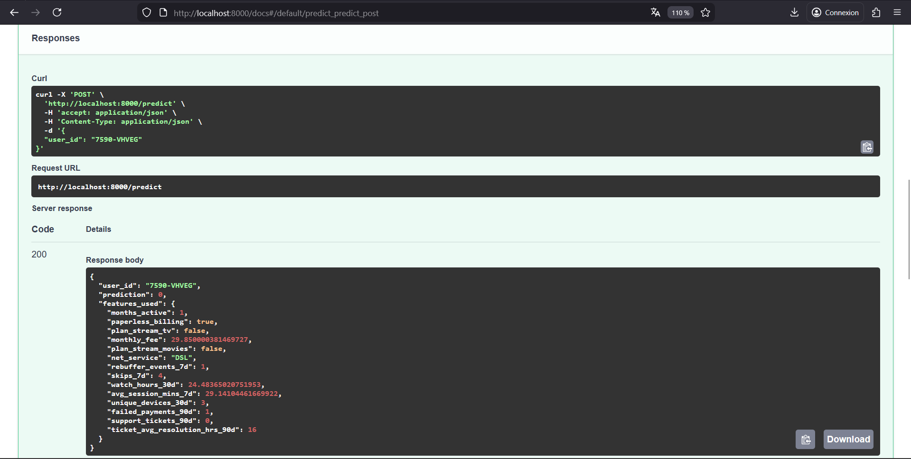

Capture commande curl : 

Question 4.g Dans votre rapport, expliquez en 5–8 lignes pourquoi le modèle chargé par l’API doit pointer vers models:/streamflow_churn/Production et pas vers un fichier local (.pkl) ou un artifact de run. 

Pointer vers models:/streamflow_churn/Production plutôt qu'un fichier .pkl local permet de bénéficier du gestionnaire de cycle de vie intégré à MLflow, qui gère automatiquement les promotions de modèles entre les différents environnements. Cette approche abstrait l'API des détails techniques des runs d'expérimentation et évite un couplage fragile avec des artefacts spécifiques qui pourraient être modifiés. Le Model Registry maintient un historique complet des versions avec leurs métriques et paramètres, assurant une traçabilité essentielle pour l'audit et la reproductibilité. Lorsqu'un nouveau modèle est promu en production, l'API le charge automatiquement sans nécessiter de redéploiement ou de modification du code. Cette séparation entre l'expérimentation et le serving suit les bonnes pratiques DevOps appliquées au machine learning, garantissant ainsi des déploiements contrôlés et résilients.

Exercice 5 : Robustesse du serving : cas d’échec réalistes (sans monitoring)

Question 5.a Testez POST /predict avec un user_id dont vous savez qu’il existe. Conservez la commande (ou capture Swagger) et la réponse JSON.

curl -X POST http://localhost:8000/predict \
  -H "Content-Type: application/json" \
  -d '{"user_id": "7590-VHVEG"}'

Réponse JSON : {"user_id":"7590-VHVEG","prediction":0,"features_used":{"months_active":1,"paperless_billing":true,"plan_stream_tv":false,"monthly_fee":29.850000381469727,"plan_stream_movies":false,"net_service":"DSL","rebuffer_events_7d":1,"skips_7d":4,"watch_hours_30d":24.48365020751953,"avg_session_mins_7d":29.14104461669922,"unique_devices_30d":3,"failed_payments_90d":1,"support_tickets_90d":0,"ticket_avg_resolution_hrs_90d":16.0}}

Question 5.b  Testez POST /predict avec un user_id qui a de fortes chances de ne pas exister dans l’online store (ex : 999999). Observez le comportement actuel de votre API. 

curl -X POST http://localhost:8000/predict \
  -H "Content-Type: application/json" \
  -d '{"user_id": "999999"}'

Réponse JSON : {"error":"Missing features for user_id=999999","missing_features":["months_active","paperless_billing","plan_stream_tv","monthly_fee","plan_stream_movies","net_service","rebuffer_events_7d","skips_7d","watch_hours_30d","avg_session_mins_7d","unique_devices_30d","failed_payments_90d","support_tickets_90d","ticket_avg_resolution_hrs_90d"]}

Question 5.c  Dans votre rapport reports/rapport_tp4.md, fournissez :

- un exemple de requête qui réussit (commande/capture) + la réponse JSON

- un exemple de requête qui échoue (commande/capture) + la réponse JSON d’erreur (avec missing_features),

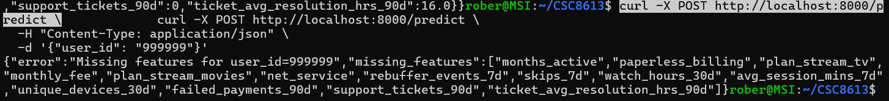

- un court paragraphe “ce qui peut mal tourner en serving et comment on le détecte tôt”. Dans ce paragraphe, discutez au minimum ces deux causes (sans refaire Feast) :
    Entité absente : le user_id demandé n’est pas présent dans l’online store.
    Online store incomplet / obsolète : la matérialisation est manquante ou n’est pas à jour (stale), ce qui se traduit par des valeurs manquantes côté API.

Lors du serving, deux défaillances critiques peuvent survenir. D'abord, le cas d'une entité absente se produit quand l'user_id demandé n'existe pas dans l'online store de Feast, généralement dû à des identifiants erronés ou à des nouveaux clients non encore intégrés. Notre API détecte ce problème en vérifiant systématiquement la présence des features avant la prédiction. Ensuite, un online store incomplet ou obsolète survient lorsque la matérialisation des features a échoué ou n'est pas à jour, conduisant à des données manquantes ou périmées. Notre système identifie ces valeurs manquantes mais pourrait être amélioré avec des métriques de fraîcheur des données et des alertes sur les échecs de matérialisation pour une détection plus proactive.

Exercice 6 : Réflexion de synthèse (ingénierie MLOps)

Question 6.a Expliquez ce que MLflow garantit dans cette pipeline : au niveau de la traçabilité des entraînements, au niveau de l’identification des modèles servis.

Au niveau de la traçabilité des entraînements, MLflow garantit un enregistrement complet et systématique de chaque exécution d'entraînement. Chaque run conserve les paramètres du modèle (comme le nombre d'estimateurs et le random_state), les métriques de performance (AUC, F1, accuracy), les artefacts (modèle sérialisé, schéma des features) et l'environnement d'exécution. Cette traçabilité exhaustive permet de reproduire exactement n'importe quel entraînement passé, de comparer différentes expérimentations et d'auditer les décisions ayant conduit au choix d'un modèle spécifique.

Au niveau de l'identification des modèles servis, MLflow assure une gestion rigoureuse du cycle de vie grâce à son Model Registry. Le registry maintient un inventaire des versions successives du modèle avec leurs stages associés (None, Staging, Production, Archived). Lorsque l'API charge le modèle via models:/streamflow_churn/Production, elle obtient toujours la dernière version officiellement promue en production, garantissant ainsi que le modèle servi est celui validé par le processus de déploiement. Cette identification précise évite les erreurs de versionnement et permet des rollbacks contrôlés si nécessaire.

Question 6.b  Expliquez ce que signifie concrètement le stage Production pour l’API : comment le modèle est sélectionné au démarrage, ce que cela permet (ou empêche) côté déploiement.

Concernant la sélection du modèle au démarrage, lorsque l'API s'initialise, elle interroge le Model Registry de MLflow pour récupérer la dernière version du modèle streamflow_churn marquée avec le stage Production. Cette sélection automatique signifie que l'API charge toujours le modèle officiellement validé pour la production, sans nécessiter de configuration manuelle ou de redéploiement lors des mises à jour de modèle.

Au niveau des implications pour le déploiement, ce mécanisme permet des transitions contrôlées entre différentes versions du modèle. Les équipes data peuvent promouvoir un nouveau modèle de Staging vers Production via l'interface MLflow, déclenchant ainsi son chargement automatique au prochain redémarrage de l'API. Cette approche empêche les déploiements accidentels de modèles non validés, tout en permettant des rollbacks rapides vers des versions précédentes si des problèmes sont détectés en production, assurant ainsi une continuité de service et une gestion rigoureuse du cycle de vie des modèles.

Question 6.c  Identifiez au moins trois points où la reproductibilité peut encore casser dans ce système, même avec MLflow (exemples : données, code, configuration, environnement). 

Premièrement, la reproductibilité des données peut être compromise si les snapshots PostgreSQL utilisés pour l'entraînement ne sont pas figés de manière immuable. Bien que la date AS_OF soit fixée, des modifications ultérieures des tables de snapshots ou des différences dans les processus d'ingestion entre les environnements pourraient altérer les données d'entraînement.

Deuxièmement, la configuration des services conteneurisés représente un risque important. Les versions d'images Docker, les variables d'environnement dans les fichiers .env, et les dépendances Python non strictement versionnées dans les fichiers requirements.txt peuvent varier entre les déploiements, affectant le comportement du modèle.

Troisièmement, le code de préprocessing et d'ingénierie des features peut introduire des variations. Si le pipeline de features dans Feast ou les transformations appliquées dans le script d'entraînement évoluent sans être parfaitement versionnés et tracés, la reproductibilité des prédictions s'en trouve affectée, même avec un modèle MLflow identique.