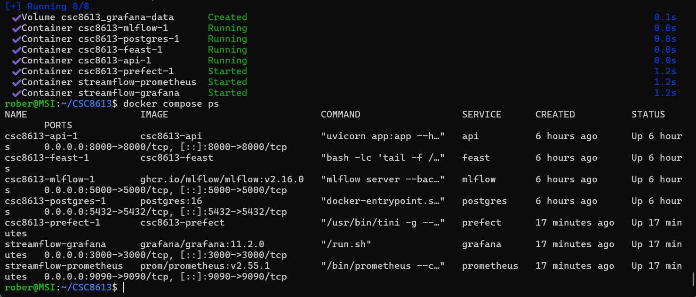
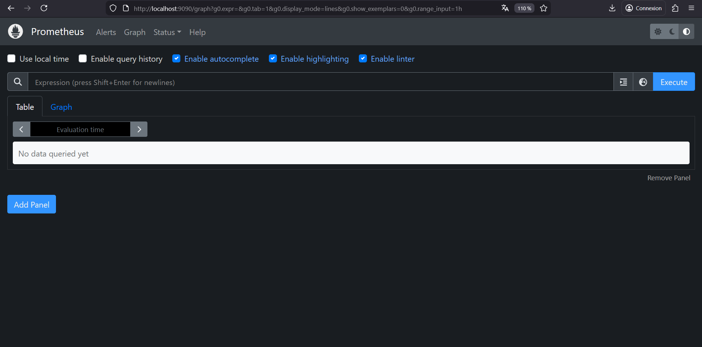
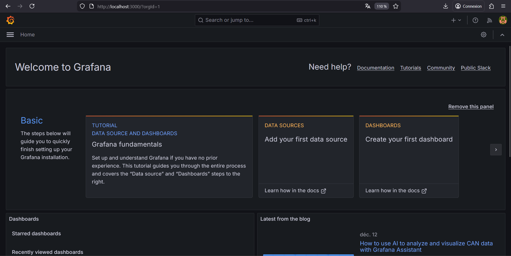
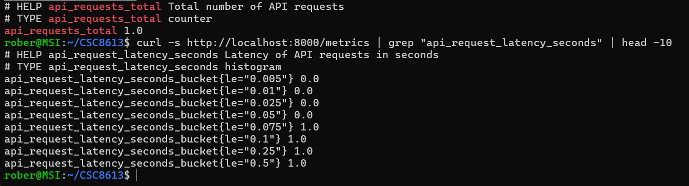
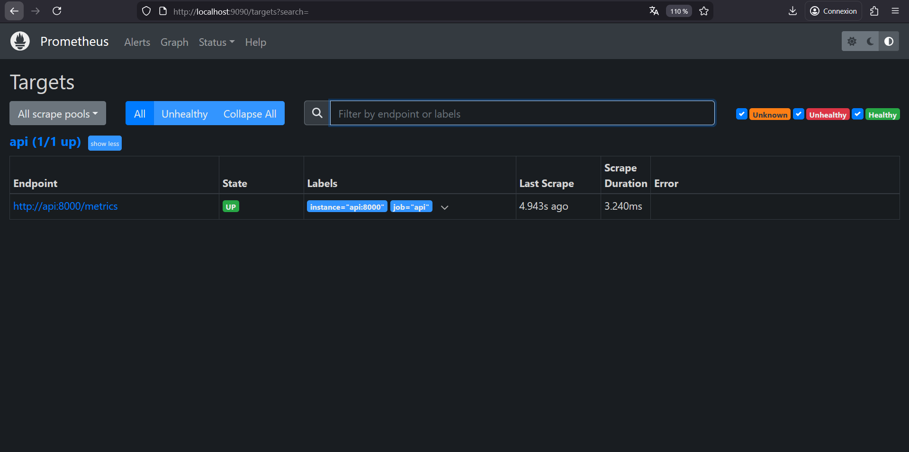
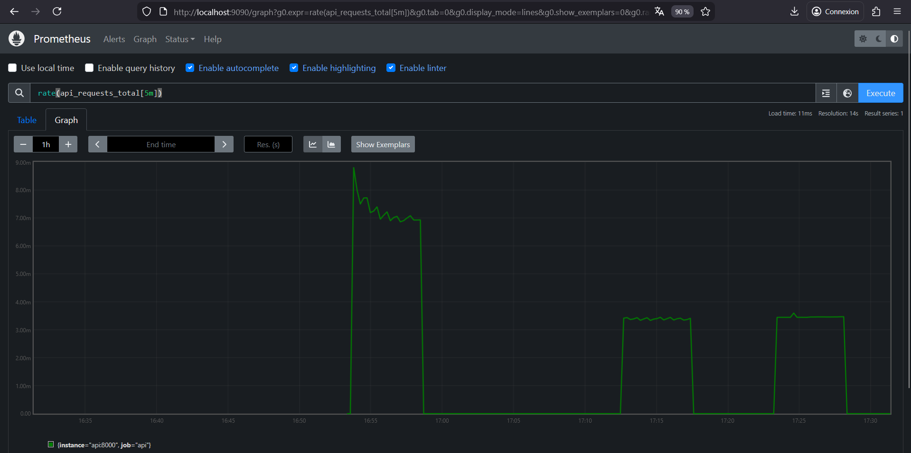
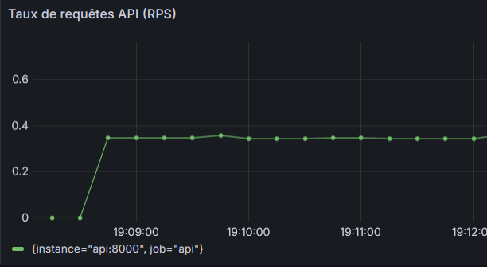
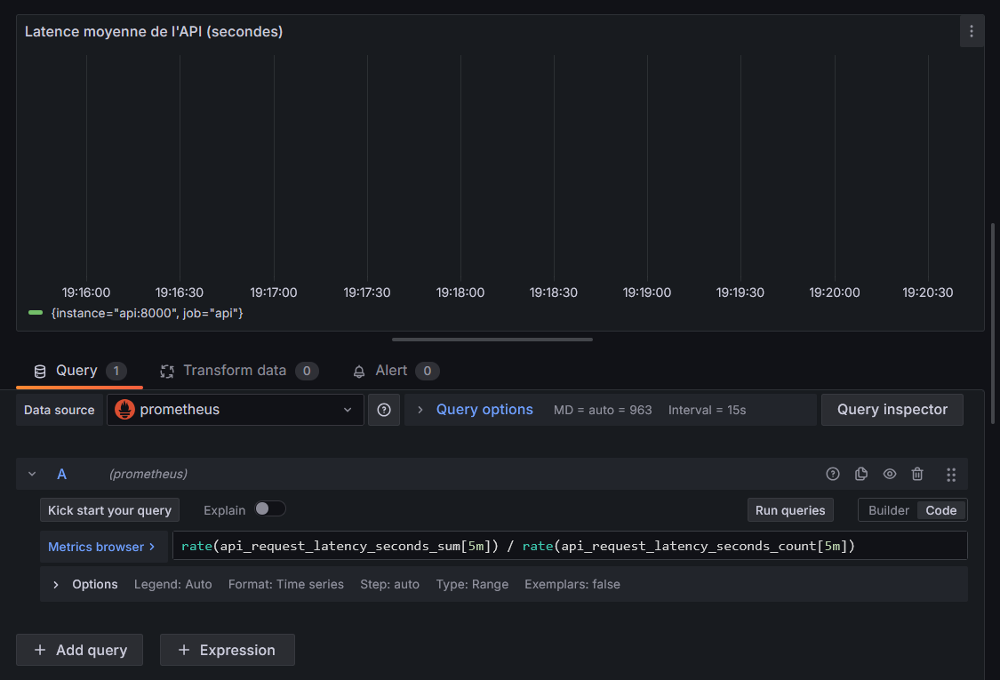
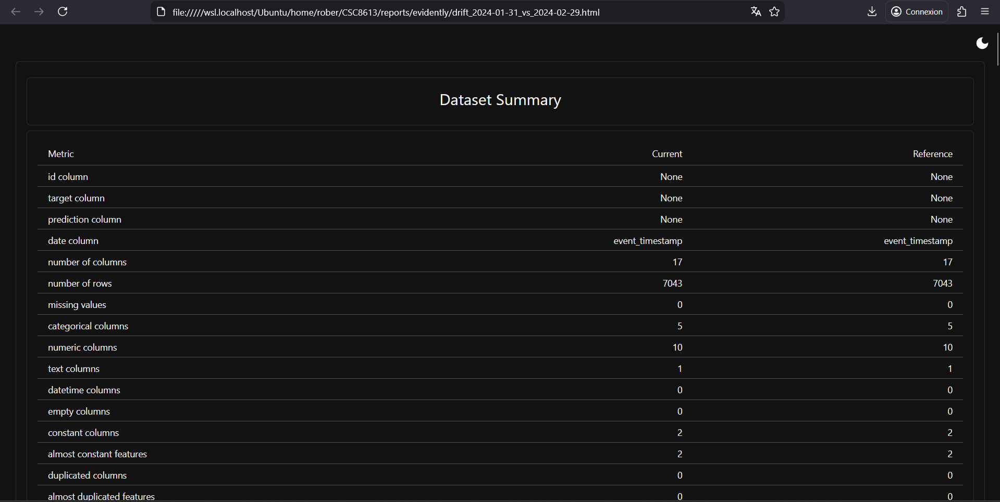

Exercice 1 : Démarrer la stack pour l'observabilité

Question 1.a  Mettez à jour votre docker-compose.yml pour inclure les services prometheus et grafana.

Question 1.b  Créez le fichier services/prometheus/prometheus.yml

Question 1.c Créez la structure de répertoires de provisioning Grafana suivante (même si certains répertoires sont vides au début) :

- services/grafana/provisioning/datasources/
- services/grafana/provisioning/dashboards/
- services/grafana/provisioning/dashboards/json/

Question 1.d Démarrez (ou redémarrez) la stack et vérifiez que tous les services sont Up.

- Lancez docker compose up -d
- Puis vérifiez avec docker compose ps

Question 1.e Validez l’accès aux interfaces web :

- Prometheus : http://localhost:9090
- Grafana : http://localhost:3000

L'accès est OK.

Identifiez aussi les noms de conteneurs (via docker compose ps) et expliquez en une phrase pourquoi Prometheus utilise api:8000 au lieu de localhost:8000. 

Prometheus utilise `api:8000` au lieu de `localhost:8000` car il fonctionne dans le réseau interne Docker Compose où les services communiquent via leurs noms de service définis dans le fichier `docker-compose.yml`. Le nom `api` correspond au service déclaré et Docker fournit automatiquement la résolution DNS interne vers l'adresse IP du conteneur correspondant, permettant ainsi à Prometheus d'accéder à l'API depuis son propre réseau conteneurisé sans nécessiter d'exposition de ports supplémentaire.

Question 1.f  Dans votre rapport reports/rapport_tp5.md, ajoutez :

Un court transcript terminal montrant docker compose up -d et/ou docker compose ps.

Une capture d’écran de la page d’accueil Prometheus.

Une capture d’écran de l’écran de login ou d’accueil Grafana.

Exercice 2 : Instrumentation de FastAPI avec de métriques Prometheus

Question 2.a  Dans api/app.py, ajoutez le strict nécessaire pour exporter des métriques Prometheus :

- Un compteur api_requests_total (Counter)
- Un histogramme api_request_latency_seconds (Histogram)
- Un endpoint HTTP /metrics qui renvoie le format Prometheus

Question 2.b  Vérifiez que l’endpoint /metrics fonctionne :

- Démarrez/re-démarrez l’API
- Exécutez curl http://localhost:8000/metrics
- Appelez /predict quelques fois et re-checkez /metrics

Vous devez constater que :

- api_requests_total augmente
- api_request_latency_seconds contient des lignes de buckets

**Commandes exécutées :**

# Rebuild et redémarrage
docker compose build api
docker compose up -d api

# Test initial
curl http://localhost:8000/metrics

# Génération de trafic
curl http://localhost:8000/health
curl -X POST http://localhost:8000/predict \
  -H "Content-Type: application/json" \
  -d '{"user_id": "7590-VHVEG"}'

# Vérification finale
curl -s http://localhost:8000/metrics | grep "api_requests_total"
curl -s http://localhost:8000/metrics | grep "api_request_latency_seconds" | head -10

Question 2.c  Dans votre rapport reports/rapport_tp5.md, ajoutez :

- Une capture d’écran (ou un court extrait copié/collé) de /metrics montrant vos deux métriques et au moins une ligne.

- Une explication en 3–5 lignes : pourquoi un histogramme est plus utile qu’une simple moyenne de latence.

L'histogramme est plus utile qu'une simple moyenne parce qu'il capture la distribution complète des temps de réponse dans des "buckets" de latence prédéfinis. Contrairement à la moyenne qui masque les valeurs extrêmes, l'histogramme permet de visualiser les cas problématiques comme les requêtes anormalement lentes. Cela rend possible le calcul de percentiles précis (p95, p99), essentiels pour évaluer la qualité de service réelle perçue par les utilisateurs.

Exercice 3 : Exploration de Prometheus (Targets, Scrapes, PromQL)

Question 3.a  Ouvrez l’interface Prometheus (http://localhost:9090) et vérifiez que la cible (target) de l’API est bien UP.

- Allez dans le menu Status puis Targets.
- Repérez le job api (ou le nom défini dans prometheus.yml).
- Vérifiez que l’état est UP et que la dernière scrappe est récente.

Question 3.b  Dans Prometheus, ouvrez l’onglet Graph (ou la barre de requête sur la page d’accueil) et exécutez les requêtes suivantes. Pour chacune, observez le résultat (valeur ou courbe) et interprétez brièvement ce que cela signifie.

- up
- api_requests_total
- rate(api_requests_total[5m])

**Requête 1 : `up`**
Objectif : Vérifier l'état de santé des cibles surveillées par Prometheus.
Résultat : up{instance="api:8000", job="api"} 1
Interprétation : La valeur up:1 confirme que la cible correspondant à notre API FastAPI est bien accessible (`UP`) et que Prometheus la scrappe activement. C'est le check de base pour s'assurer que la collecte de données fonctionne.

**Requête 2 : `api_requests_total`**
Objectif : Afficher la valeur actuelle et cumulée du compteur total de requêtes.
Résultat :
api_requests_total{instance="api:8000", job="api"} 1
Interprétation : Cette métrique est un compteur qui agrège toutes les requêtes de l'API. La valeur 1 indique qu'exactement une requête a été comptabilisée depuis le dernier redémarrage de l'application ou la dernière réinitialisation du processus Python.

**Requête 3 : `rate(api_requests_total[5m])`**
Objectif : Calculer le taux de requêtes par seconde, lissé sur une fenêtre glissante de 5 minutes. C'est la métrique opérationnelle clé.
Résultat :
{instance="api:8000", job="api"} 0.0034581255576227464
Interprétation : Cette valeur (~0.0034) représente le taux moyen de requêtes par seconde sur les 5 dernières minutes. Cela signifie qu'en moyenne, l'API a traité 0.0034 requête par seconde sur cette période, ce qui équivaut à environ une requête toutes les 5 minutes. Cette métrique est bien plus utile que le compteur brut car elle donne une idée de l'activité récente du service.

Question 3.c Affichez une vue simple de la latence basée sur l’histogramme. Exécutez cette requête et observez comment elle évolue lorsque vous générez du trafic : rate(api_request_latency_seconds_sum[5m]) / rate(api_request_latency_seconds_count[5m])

J'obtiens en sortie {instance="api:8000", job="api"} 0.05121445655822754

Expliquez en une phrase ce que représente cette valeur. 

Cette valeur de 0.051 secondes représente la latence moyenne par requête de l'API sur les 5 dernières minutes.

Question 3.d Dans votre rapport reports/rapport_tp5.md, ajoutez :

Une capture d’écran de la page Status → Targets montrant la target de l’API en UP.

Une capture d’écran d’un graphe Prometheus correspondant à une requête PromQL (par exemple rate(api_requests_total[5m])).

Exercice 4 : Setup de Grafana Setup et création d'un dashboard minimal

Question 4.a  Ajoutez la datasource Prometheus dans Grafana.

Ouvrez Grafana : http://localhost:3000
Allez dans Connections - Data sources (dans le menu à afficher à gauche).
Ajoutez une datasource Prometheus qui pointe vers http://prometheus:9090.

Question 4.b Créez un nouveau dashboard Grafana et ajoutez un premier panel affichant le nombre de requêtes par seconde (RPS).

Créez un nouveau dashboard dans le menu Dashboards.
Ajouter Prometheus comme source
Ajoutez un panel de type Time series (en haut à droite).
Utilisez une requête PromQL basée sur api_requests_total comme vue à l'exercice précédent. Vous devez la mettre dans le menu en bas à gauche, soit en utilisant le Builder, soit le code brut (à droite de "Run queries").
Choisissez une fenêtre temporelle glissante (par exemple 5 minutes).
Cliquez sur "Run queries" pour afficher la métrique.
Donnez un nom à votre panel
Cliquez sur Apply en haut à droite pour terminer voter panel

Question 4.c Ajoutez un deuxième panel visualisant la latence de l’API.

Créez un nouveau panel (Add, Visualization) de type Time series.
Utilisez une requête simple basée sur l’histogramme de latence.
Observez comment la courbe évolue lorsque vous générez du trafic.
Donnez un nom à votre panel
Cliquez sur Apply

Une approximation de la latence moyenne est suffisante pour ce TP. 

Question 4.d Générez du trafic vers l’API et observez l’impact sur votre dashboard.

Appelez l’endpoint /predict environ 50 à 100 fois.
  for i in {1..100}; do
    curl -s -X POST http://localhost:8000/predict \
      -H "Content-Type: application/json" \
      -d '{"user_id":"U0001"}' > /dev/null
  done
        
Vous pouvez ajouter un sleep X dans la boucle pour attendre X secondes entre chaques requêtes.
Regardez les courbes RPS et latence évoluer (vous pouvez rafraichir en haut à droite).
Configurez un intervalle de rafraîchissement automatique (5s ou 10s en haut à droite).

On observe que le panel RPS (taux de requêtes) augmente puis se stabilise.

Question 4.e Dans votre rapport reports/rapport_tp5.md, ajoutez :

Une capture d’écran du dashboard Grafana avec un pic de trafic visible.

Une capture d’écran de l’éditeur de requête d’un panel.

Un court texte (5–8 lignes) expliquant ce que ces métriques détectent bien, et ce qu’elles ne permettent pas de détecter (ex: qualité du modèle).

Ces métriques d'infrastructure détectent efficacement les problèmes opérationnels immédiats. Le taux de requêtes (RPS) signale les pics de trafic anormaux ou les arrêts de service, tandis que la latence moyenne révèle les dégradations de performance liées à la charge, aux ralentissements réseau ou aux goulots d'étranglement des ressources. Cependant, ce monitoring bas niveau ne permet pas d'évaluer la qualité des prédictions du modèle en production. Il ne détecte pas le concept drift (changement des distributions d'entrée), le data drift (évolution des patterns des features), ni la dégradation des métriques métier comme la précision ou le recall. Une chute de la performance prédictive pourrait survenir alors que le RPS et la latence restent parfaitement normaux.

Exercice 5 : Drift Detection with Evidently (Month_000 vs Month_001)

Question 5.a Créez le fichier services/prefect/monitor_flow.py en vous appuyant sur le squelette ci-dessous.

Question 5.b  Exécutez le script de monitoring (dans le conteneur Prefect ou depuis votre environnement selon votre setup) avec
docker compose exec -e REPORT_DIR=/reports/evidently prefect \
  python /opt/prefect/flows/monitor_flow.py
et vérifiez :

Qu’un rapport HTML et un rapport JSON sont créés dans reports/monitoring.
Que la ligne finale imprimée contient drift_share=... et une décision (RETRAINING_TRIGGERED ou NO_ACTION).
Qu’il n’y a pas d’erreur de schéma (colonnes différentes entre ref et current).

Tout est OK.

Question 5.c Dans votre rapport reports/rapport_tp5.md, ajoutez :

Une capture d’écran du rapport Evidently (HTML) ou d’une section clé montrant la comparaison ref vs current.

Une réponse courte : différence entre covariate drift et target drift dans ce projet.

Le covariate drift concerne l'évolution des variables d'entrée (comme monthly_fee ou watch_hours_30d), tandis que le target drift mesure les changements dans la variable cible (churn_label). Dans notre cas, le covariate drift est faible (6%) et le target drift est nul (0.0), ce qui signifie que les données d'entrée ont peu évolué et que le taux de churn est resté stable.

Le copier/coller de la ligne de décision finale imprimée par le script.

[Evidently] report_html=/reports/evidently/drift_2024-01-31_vs_2024-02-29.html report_json=/reports/evidently/drift_2024-01-31_vs_2024-02-29.json drift_share=0.06 -> NO_ACTION drift_share=0.06 < 0.30 (target_drift=0.0)
