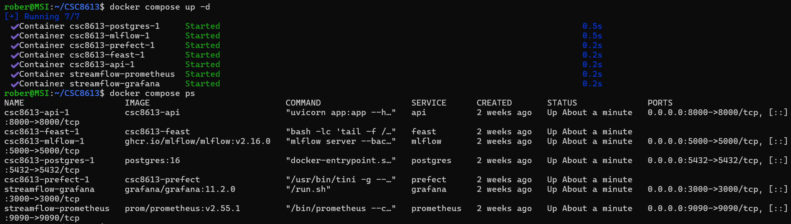
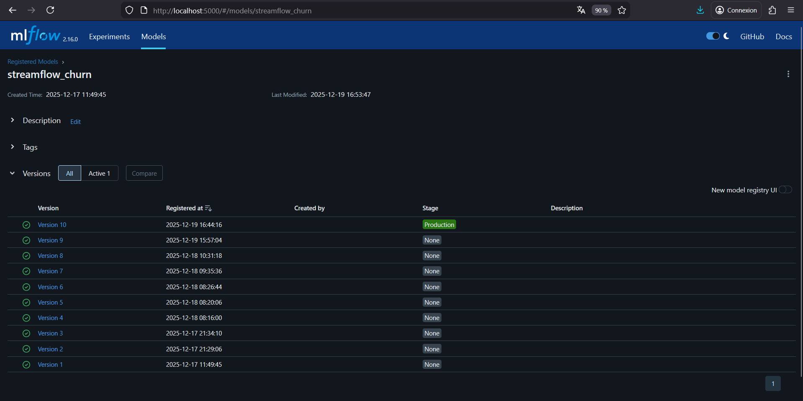
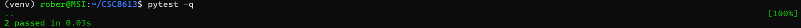
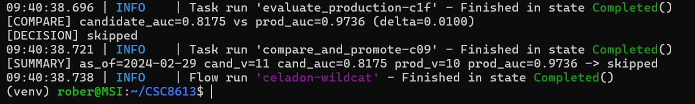
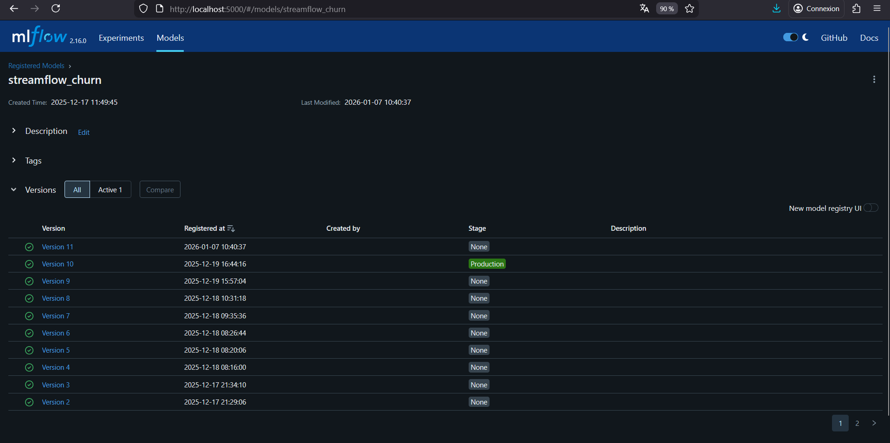
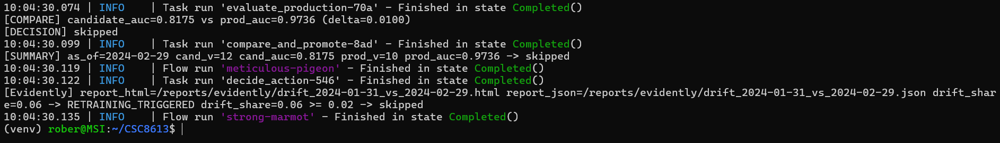
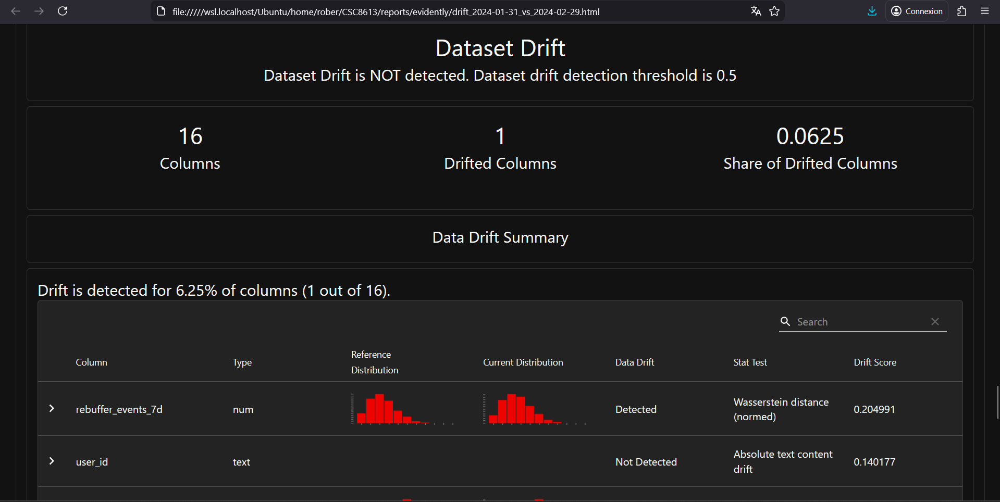
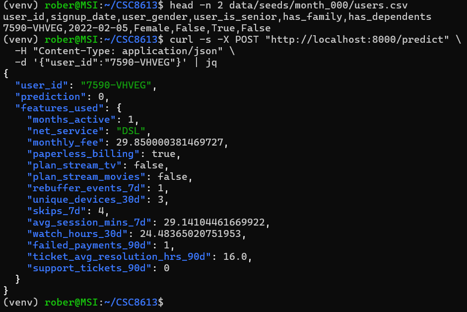

Exercice 1 : Mise en place du rapport et vérifications de départ

Question 1.b  Démarrez la stack et vérifiez que les services principaux sont Up. 

docker compose up -d
docker compose ps
docker compose logs -f api

Question 1.c Vérifiez que vous avez déjà un modèle en Production dans MLflow.

Ouvrez http://localhost:5000
Allez dans Models → streamflow_churn
Vérifiez qu’une version est bien au stage Production

Question 1.d  Dans votre rapport, ajoutez :

Un transcript terminal montrant docker compose up -d et docker compose ps

Une capture MLflow montrant la version Production au début du TP

Exercice 2 : Ajouter une logique de décision testable (unit test)

Question 2.a Créez le fichier services/prefect/compare_utils.py avec la fonction suivante. Complétez la condition (TODO).

Question 2.b Créez un test unitaire minimal dans tests/unit/test_compare_utils.py. 

Question 2.c  Lancez les tests localement.
- pip install pytest
- pytest -q

Question 2.d Dans votre rapport, ajoutez :

Un transcript terminal montrant pytest -q (succès).

Une phrase expliquant pourquoi on extrait une fonction pure pour les tests unitaires.

Nous extrayons une fonction pure should_promote() pour les tests unitaires afin de pouvoir tester la logique de décision de manière isolée, sans dépendre de services externes comme MLflow ou Prefect. Cela permet des tests rapides, fiables et reproductibles qui ne nécessitent pas de déployer une infrastructure complexe.

Exercice 3 : Créer le flow Prefect train_and_compare_flow (train → eval → compare → promote)

Question 3.a  Créez le fichier services/prefect/train_and_compare_flow.py en partant du code ci-dessous. 

Question 3.b  Exécutez le flow dans le conteneur Prefect. docker compose exec prefect python train_and_compare_flow.py
    
Question 3.c  Vérifiez dans MLflow si une nouvelle version a été promue (si promoted).

- Ouvrez MLflow UI
- Regardez le stage Production (nouvelle version ? ancienne archivée ?) : L'ancienne version reste en production car elle a de meilleures performances. La nouvelle version reste en NONE.

Question 3.d Dans votre rapport, ajoutez :

Un transcript des logs du flow (au minimum les lignes [COMPARE] et [SUMMARY])

Une capture MLflow montrant le résultat (Production promu ou non)

Une phrase expliquant pourquoi on utilise un delta

On utilise un delta (seuil de 0.01) pour éviter les promotions pour des améliorations petites qui pourraient être dues au bruit statistique plutôt qu'à une réelle supériorité du modèle. Cela stabilise le système en production en évitant le "ping-pong" entre versions pour des gains insignifiants et cela garantit que seules les améliorations conséquentes déclenchent un changement de modèle en production.

Exercice 4 : Connecter drift → retraining automatique (monitor_flow.py)

Question 4.a Dans services/prefect/monitor_flow.py :

- Gardez les dates par défaut (elles sont correctes dans ce projet).
- Utilisez un seuil de déclenchement de retrain à 0.02 (pour forcer le réentrainement, à modifier dans le paramètres par défaut de monitor_month_flow).
- Appelez train_and_compare_flow(as_of=as_of_cur) quand drift_share >= threshold.

Question 4.b Exécutez le monitoring (référence month_000 vs current month_001) avec un seuil à 0.02.
docker compose exec prefect python monitor_flow.py

drift_share=0.06 >= 0.02 donc ça déclenche un réentrainement.

Question 4.c  Dans votre rapport, ajoutez :

Une capture (ou extrait) du rapport Evidently HTML (fichier reports/evidently/drift_*.html)

Un extrait de logs montrant le message RETRAINING_TRIGGERED ... et le résultat promoted/skipped

drift_share=0.06 → Dépasse le seuil de 2% → Réentraînement déclenché. Le nouveau modèle a été évalué. La décision est que le nouveau modèle n'est pas promu car il a de moins bonnes performances d'auc que celui en production. (should_promote(new_auc=0.8175, prod_auc=0.9736, delta=0.01) → faux ). Cela montre que même avec du drift dans les données, le modèle actuel reste performant.

Exercice 5 : Redémarrage API pour charger le nouveau modèle Production + test /predict

Remarque :  Votre API charge le modèle au démarrage (MLflow URI models:/streamflow_churn/Production). Donc si une promotion a eu lieu, il faut redémarrer l’API pour qu’elle recharge la nouvelle version.

Question 5.a Redémarrez uniquement le service API.
docker compose restart api
docker compose logs -f api
    
Question 5.b Faites un appel de prédiction sur un user_id existant. Vous pouvez récupérer un user_id depuis un CSV seed (month_000 ou month_001).

head -n 2 data/seeds/month_000/users.csv
# Copiez un user_id réel, puis :
curl -s -X POST "http://localhost:8000/predict" \
  -H "Content-Type: application/json" \
  -d '{"user_id":"TODO_USER_ID"}' | jq

Question 5.c Dans votre rapport, ajoutez :

Un transcript curl montrant la réponse JSON

Une phrase expliquant pourquoi l’API doit être redémarrée

L'API doit être redémarrée car elle charge le modèle MLflow en production avec l'URI models:/streamflow_churn/Production, c'est donc important de redémarrer si on a promu un nouveau modèle en production.

Exercice 6 : CI GitHub Actions (smoke + unit) avec Docker Compose

Question 6.a Créez le fichier .github/workflows/ci.yml avec le workflow suivant (à copier-coller). Note : ce workflow est volontairement minimal et adapté à votre arborescence actuelle (API dans api/).

Question 6.b Poussez sur GitHub (ou ouvrez une PR) pour déclencher la CI. Dans GitHub, vérifiez que les deux jobs passent.

git add .
git commit -m "Ajout CI GitHub Actions avec tests unitaires et intégration"
git push origin main

